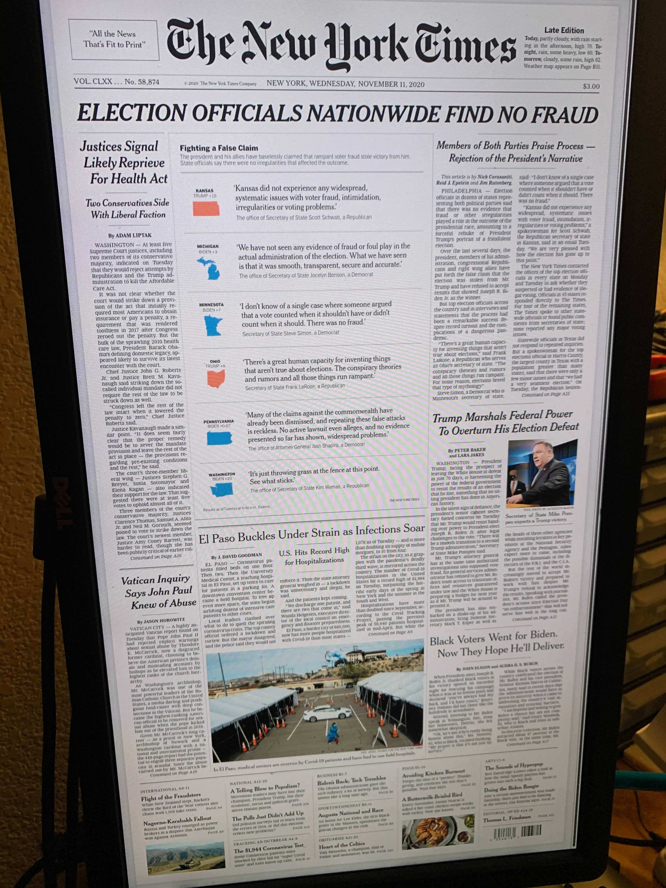

# nyt-frontpage-server 

An app that fetches the daily the front page of the New York Times newspaper and serves as an html page through a Go webserver. You can run this server and display this on any screen. Whenever a new frontpage is available the webpage will update automatically.

***Taken on Nov 12th 2020. 24 inch vertical monitor***


### Getting Started 

#### Docker: 

* Build the docker image 
    ```
    docker build -t nyt-server .
    ```

* Run the docker image 
    ```
    docker run -d nyt-server
    ```
    if you like to run this on a different port (i.e - on port 3000 of the host)
    ```
    docker run -d -p 3000:80 nyt-server
    ```